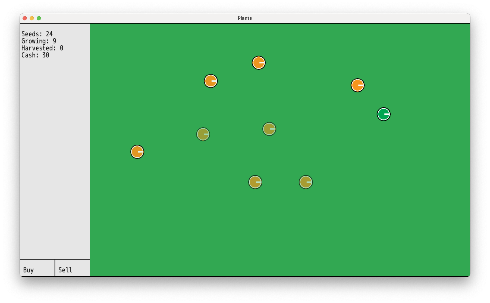

# Plants
A gardening game built with DragonRuby GTK.

## Gameplay
- Plant seeds in the garden by clicking inside the garden
- Plants grow over time, harvest when fully grown
- Additional seeds can be collected from withered plants
- Sell harvested plants to buy more seeds

### Plant Lifecycle
- Yellow sprite: Growing
- Green sprite: Ready to harvest
  - Harvested plants can be sold for cash
- Orange sprite: Withered
  - Withered plants may drop 0 to 10 seeds
  - Withered plants eventually die

## To Play
- clone repo
- cd into dir
- run `./dragonruby`
