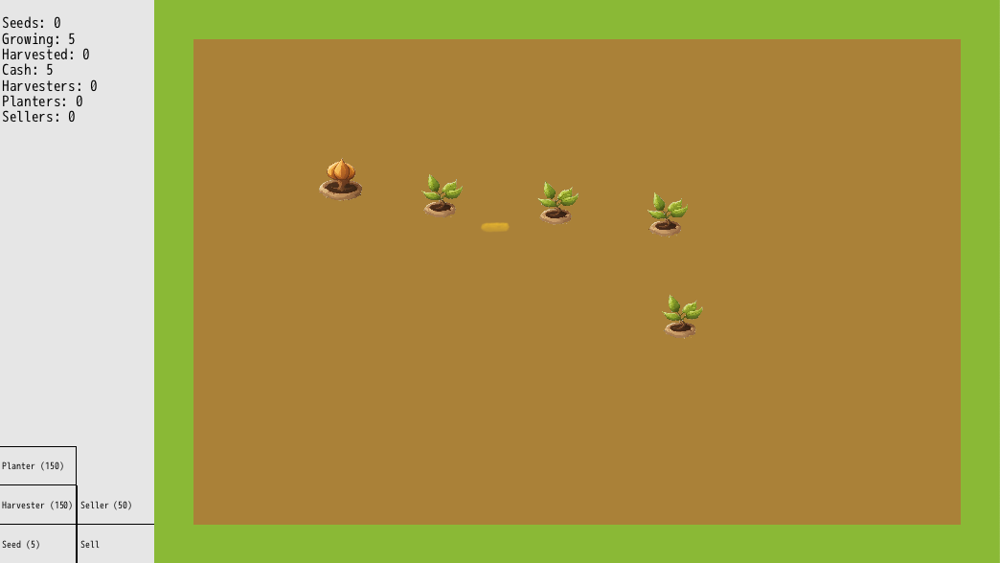

# Idle Garden
A gardening game built with DragonRuby GTK.

## Gameplay
- Plant seeds in the garden by clicking inside the garden
- Plants grow over time, harvest when fully grown
- Additional seeds can be collected from withered plants
- Sell harvested plants to buy more seeds
- Buy automations to harvest, plant, & sell for you

### Plant Lifecycle
- Planted
- Growing
- Ready to harvest
  - Harvested plants can be sold for cash
- Withered
  - Withered plants may drop 0 to 10 seeds
  - Withered plants eventually die

## To Play
[Itch.io](https://jalamb5.itch.io/idle-garden)

- clone repo
- cd into dir
- run `./dragonruby`

## Attributions
- Engine: [DragonRuby Toolkit](https://dragonruby.org/)
- Images: AI Generated[^1] - [DeepAI](https://deepai.org/machine-learning-model/text2img)

## Footnotes
[^1]: I've used AI to generate the images for the sake of expediency and due to my own lack of artistic ability. But I'm not proud of it, if I'm able I'll replace this with legitimate art in the future.
