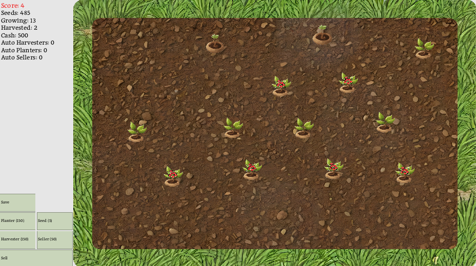

# Idle Garden
A gardening game built with DragonRuby GTK.

## Gameplay
- Plant seeds in the garden by clicking inside the garden
- Plants grow over time, harvest when fully grown
- Additional seeds can be collected from withered plants
- Sell harvested plants to buy more seeds
- Buy automations to harvest, plant, & sell for you

### Plant Lifecycle
- Planted
- Growing
- Fully grown
- Ready to harvest
  - Harvested plants can be sold for cash
- Withered
  - Withered plants may drop 0 to 10 seeds
  - Withered plants eventually die

### Scoring
- Harvest withered plant: 1 point
- Harvest ripe plant: 2 points
- Sell ripe plants: (number of plants) * 10

## To Play
[Itch.io](https://jalamb5.itch.io/idle-garden)

## Attributions
- Engine: [DragonRuby Toolkit](https://dragonruby.org/)
- Images (Grass and Soil): [DeepAI](https://deepai.org/machine-learning-model/text2img)[^1]
- Sound Effects: [jsfxr](https://sfxr.me/)
- Background Track: [Suno](https://suno.com/)[^1]
- Fonts: [Maname Regular](https://fonts.google.com/specimen/Maname), [Tiny 5](https://fonts.google.com/specimen/Tiny5)

## Footnotes
[^1]: I've used AI to generate some art for the sake of expediency and due to my own lack of artistic ability. But I'm not proud of it and am currently working to replace this with custom art. Pixel art images are all custom designs.
